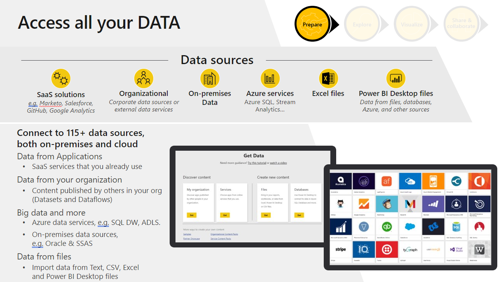
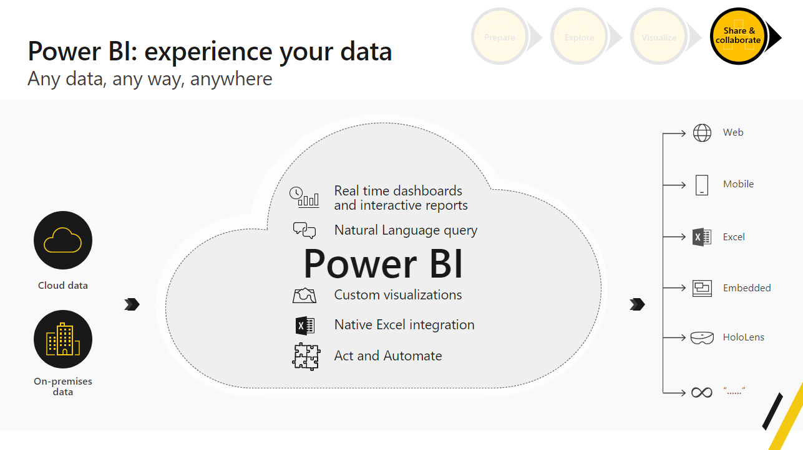
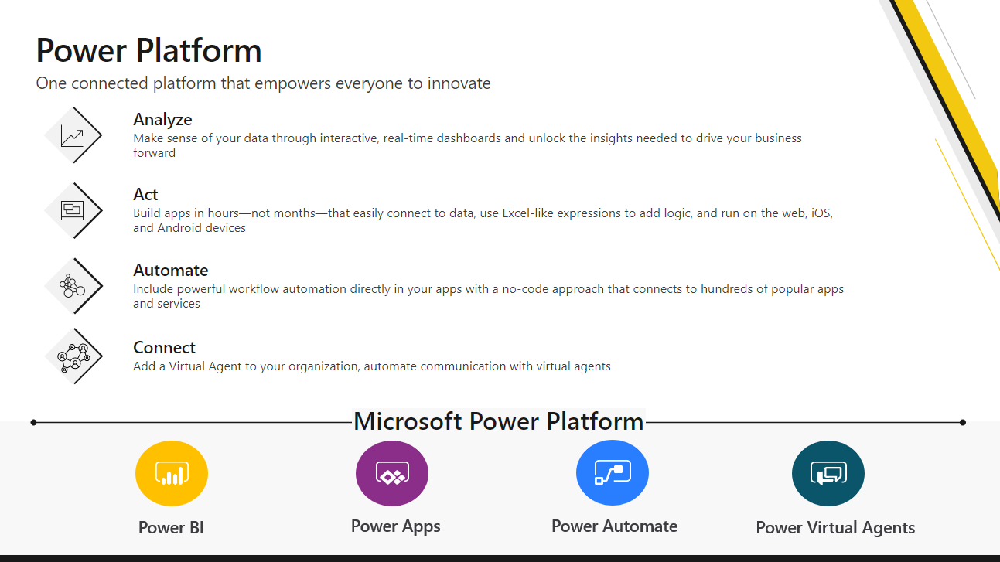
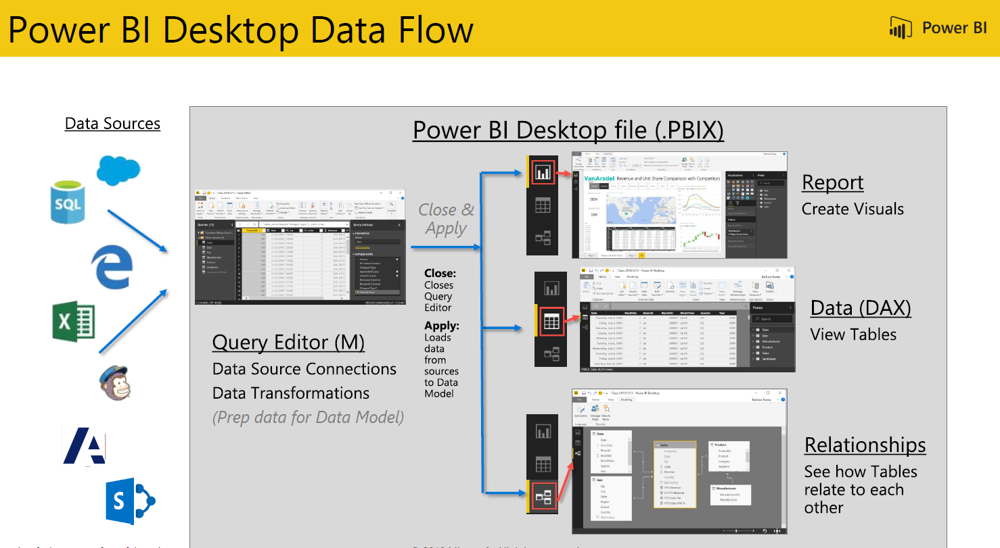
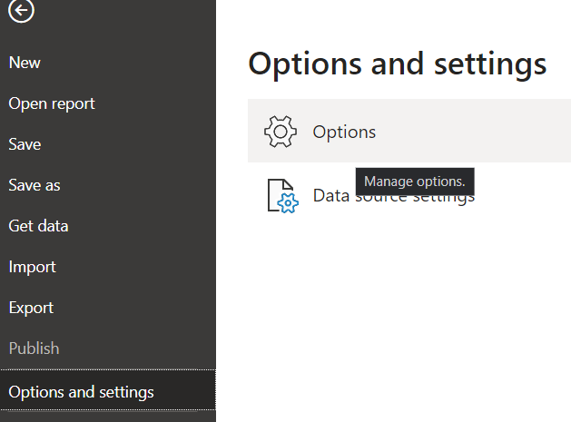

# OneStream Power BI Custom Connector User Guide

> [!NOTE]
> The following connector artical provided by OneStream Software, the owner of this connector
 and a member of the Microsoft Power Query Connector Certification program.  If you have 
 questions regqarding the content of this article of have changes you would like to see made to
 this article, visit the OneStream Software website and use the support channels there.

## Summary
| Item | Description |
| ---- | ----------- |
| Release State | General Availability (Beta) |
| Products | Power BI (Datasets) Power BI (Dataflows)|
| Authentication Types Supported | Basic OneStream License |

## Prerequisites
 There is a minimum OneStream platform version of 8.2.  

## Capabilities Supported
The OneStream Connector enables secure access to your OneStream applications. With the connector you can:
* Export cube and relational data from OneStream applications, directly into Power BI.
* Export metadata members and all their OneStream properties.
* Easily recreate your full hierarchy structures in Power BI
* Automate data loads to Power BI service.

## Power BI Overview

 Power BI is a collection of software services, apps, and connectors   
 that work together to turn your unrelated sources of data into        
 coherent, visually immersive, and interactive insights. Your data may 
 be an Excel spreadsheet, or a collection of cloud-based and           
 on-premises hybrid data warehouses. Power BI lets you easily connect  
 to your data sources, visualize, and discover what\'s important, and  
 share that with anyone or everyone you want.                          
                                                                       
 Source: [What is Power BI?](https://docs.microsoft.com/en-us/power-bi/fundamentals/power-bi-overview)

    

 
 

## Power BI Desktop

 Power BI Desktop is a free application you install on your local
 computer that lets you connect to, transform, and visualize your
 data. With Power BI Desktop, you can connect to multiple various
 sources of data, and combine them (often called modeling) into a data
 model. This data model lets you build visuals, and collections of
 visuals you can share as reports, with other people inside your
 organization. Most users who work on business intelligence projects
 use Power BI Desktop to create reports, and then use the Power BI
 service to share their reports with others.

 Source: [What is Power BI Desktop?](https://docs.microsoft.com/en-us/power-bi/fundamentals/desktop-what-is-desktop)

 

## OneStream Power BI Custom Connector

### Power BI Desktop Installation and Configuration

- Install Power BI Desktop:
   - <https://powerbi.microsoft.com/en-us/downloads/>

- Open Power BI Desktop, go to File -\> Options and settings -\>  Options

- Go to Security -\> Data Extensions and select (Not Recommended)

> [!NOTE]
> This setting will not be required after OneStream Custom Connector Certification by Microsoft.

- Click "OK" and Close Power BI Desktop

### OneStream Connector Local Machine Setup

> [!NOTE]
> This step is required till Microsoft certification of OneStream Custom Connector.

- Create a folder in C:\\Users\\\*currentuser\*\\Documents\\Microsoft
    Power BI Desktop named "Custom Connectors." This folder will be the
    location of all custom connectors and where Power BI will look for
    custom connectors:

- Save the provided ".mez" files to the new "Custom Connectors" folder

- Open Power BI Desktop and select "Get Data"

- Type "OneStream" in the search box to find the custom OneStream
    connector.

- The above step confirms successful configuration of OneStream
    Connector and its ready for fetching date to generate reports.

## OneStream Authentication

- Open Power BI Desktop and select "Get Data."

- Type "OneStream" in the search box to find the custom OneStream
    connectors.

- Click on the OneStream connector.

- Ensure that the Environment URL is entered with a leading **https://**
    (as shown in the screenshot below)
 - Otherwise, connection attempts will not work properly.

- Click on "Sign In" to connect to OneStream environment.

- It will redirect and open the default browser for login.

- Log in to OneStream Account.

- 

- After successful login click on "Connect"

## OneStream Navigator

- After successful login, OneStream Connector will show the navigator to make 4 types of calls
  - Get Cube
  - Get Custom Adapter
  - Get Dimension
  - Get Member Properties

- Based on the requirement provide the values for the given function.
    You can toggle the parameters to just the required ones or use all
    of them if necessary, Power BI will display a preview of data for
    the table that would be returned.

- After providing the parameters, click on Load or Transform the data.
  - Select **Load** to load the table into the internal Power BI
        Desktop data model.
  - Select **Transform data** to make changes in the table before
        loading it into the internal Power BI Desktop data model.
        **Transform data** will launch Power Query Editor in a new
        window with a representative view of the table.

- If you need to load additional tables, repeat the steps above of
    picking the function and providing the values and
    loading/transforming the table

- After data load to Power BI Desktop data model, we can create
    relationships between tables as well as create reports.

## Details on OneStream Custom Connector

OneStream Connector fetches data from OneStream instance using REST
(Representational State Transfer) APIs. For More information on
OneStream REST APIs: [OneStream
Documentation.](https://femsadev.onestreamcloud.com/OneStreamWeb/Help/Content/Home_external.htm)

OneStream Connector performs all APIs calls under the permission
boundary of Current logged-in user. Connector only uses READ scopes on
behalf of Power BI report user to perform all operations. Following are
the scopes used:

 **'onestream.powerbi, offline_access'**

OneStream connector cannot perform any OneStream / Update operation.

## Publish Power BI Reports to Power BI Service

- Click on the "Publish" button from Power BI Desktop to publish data,
    reports, and data model to the cloud-based Power BI Service.

- Choose the appropriate Power BI workspace and click "Select"

- After a successful publication, we will see a "Success" message with
    a link to navigate to the Power BI Service

- Click on the link to view all reports from the Power BI Desktop in
    the Power BI Service as well as create dashboards in the Power BI
    Service

- From the Power BI Service workspace, user will receive error when
    chick on "Refresh now" for the dataset created from the Power BI
    Desktop file. We will need to set up an "On-premises data gateway
    for custom connector" for the data refresh to work.

## Best Practices & Tips

- Load only the necessary grain of data. Meaning, if you only need
    aggregated data at the month level, don't load data at the daily
    level. While Power BI can handle hundreds of millions of rows, if
    not more, the smaller the model, the more performant it will always
    be.

- Limit the number of transformations you make. The more you
    complicate the query, the more chance there is for the query to
    fail.

- Leverage OneStream's financial logic and Cube Views/Data Adapters to
    create the tables that will then be loaded into Power BI.
  - Example: Consolidations involve the parent entity only taking
        40% of one of the child entities' values. Ensure that this logic
        is done in OneStream, and you load the data adapter in Power BI
        which already has the values populated. Attempting to replicate
        the logic in Power BI would be extremely inefficient and is
        better performed in the source system.

- When providing All for ScenarioType, the results will return the
    scenariotype of default that's been configured in OneStream 

## Install On-Premises Data Gateway for OneStream Custom Connector and Data Refresh

 > [!NOTE]
 > This step is required till Microsoft certification of OneStream Custom Connector.

 > [!NOTE]
 > This setting is needed until OneStream Custom Connector is Certified by Microsoft.

- Install On Premise data Gateway:
  - <https://www.microsoft.com/en-us/download/details.aspx?id=53127>

- Follow the steps in the Microsoft document for initial setup and
    details [Use custom data connectors with the on-premises data
    gateway - Power BI \| Microsoft
    Docs](https://learn.microsoft.com/en-us/power-bi/connect-data/service-gateway-custom-connectors)

- Provide "NT SERVICE\\PBIEgwServic" account full permission on
    C:\\Users\\\*currentuser\\Documents\\Microsoft Power BI
    Desktop\\Custom Connectors folder.

 

-  

## OneStream Connector Certification Process and Considerations

The OneStream Custom Connector is in the process of certification with
Microsoft. After review and certification, Microsoft will release
'OneStream Connector to public and it will be directly available from
"Get Data" section of 'Power BI Desktop' and 'Power BI Service.'

Power BI Desktop

For more information : Official connectors in Power Query
(<https://docs.microsoft.com/en-us/power-query/connectors/> )

There are few sections in this document which will not be relevant after
Certification.

- Security setting under section: [Power BI Desktop Installation and
    configuration](#power-bi-desktop-installation-and-configuration)

- [OneStream Connector
    location](#onestream-connector-local-machine-setup). This section
    will not be required as OneStream connector will be directly
    available under Power BI "Get Data" section.

- [Install On-Premises Data Gateway for Customer Connectors and Data
    Refresh](#install-on-premises-data-gateway-for-onestream-custom-connector-and-data-refresh).
    Prem Gateway will not be required after certification. OneStream
    certified connector will be able to communicate directly with
    OneStream REST APIs and perform "Refresh Data" operation.

More information on Certification process: [Power Query Connector
Certification](https://docs.microsoft.com/en-us/power-query/connectorcertification)

## Local Machine Cleanup Post Microsoft Certification

### Revert "Power BI Desktop" to Recommended setting

- Open Power BI Desktop, go to File -\> Options and settings -\>
    Options

- Go to Security -\> Data Extensions and select -\> (Recommended)

- Click "OK" and Close Power BI Desktop

### Remove "OneStream.mez" local file

- Go to C:\\Users\\\*currentuser\*\\Documents\\Microsoft Power BI
    Desktop\\Custom Connectors."

- Delete "OneStream.mez" file.

- OneStream will be directly available from "Get Data" section of
    "Power BI Desktop" after Microsoft certification.

### Uninstall On-Premises Data Gateway

- Go to local machine "Programs and Features".

- Find "On-premises data gateway"

- Right click and "Uninstall" the program.

 

- Follow the uninstallation wizard.
